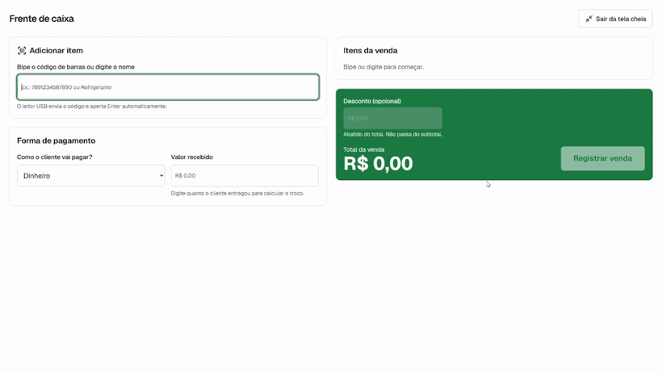
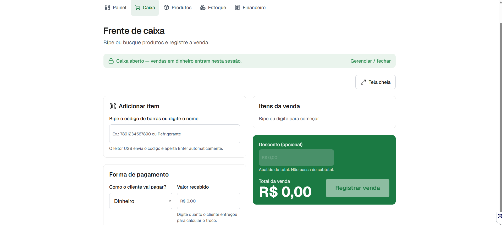
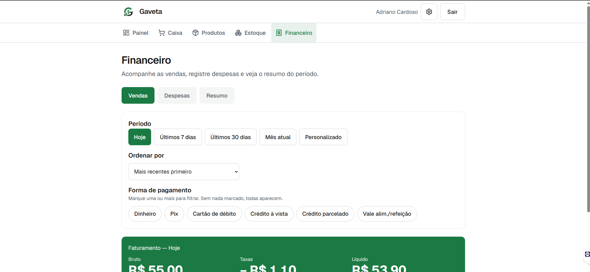
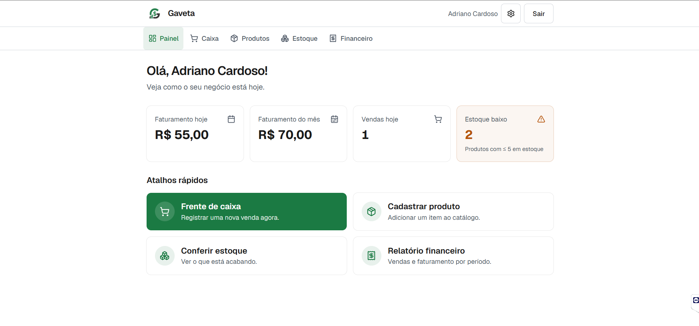
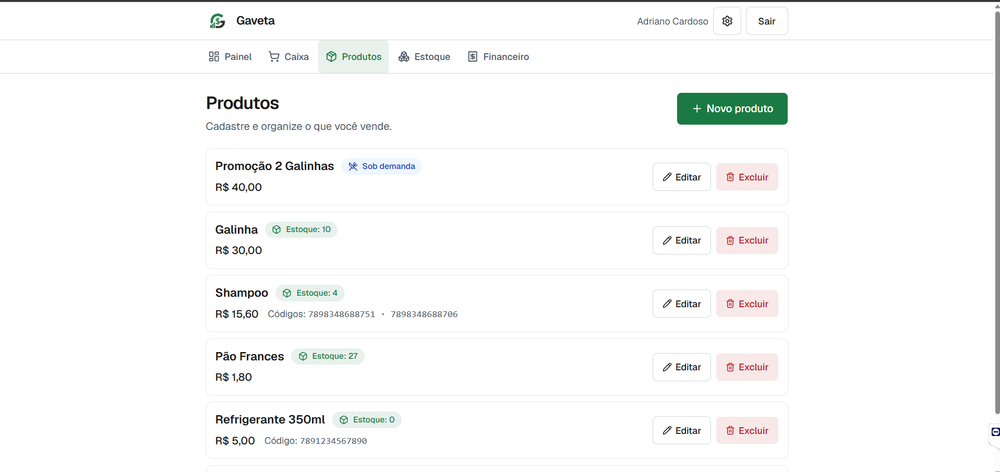
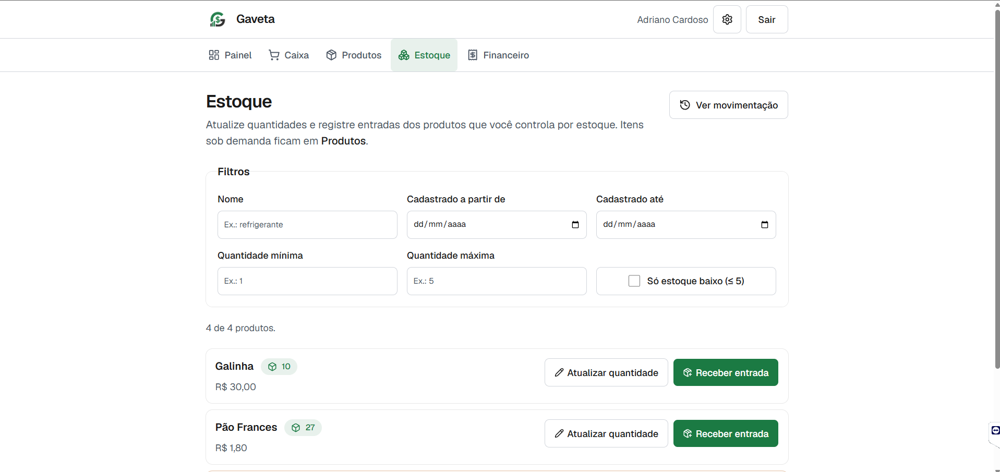
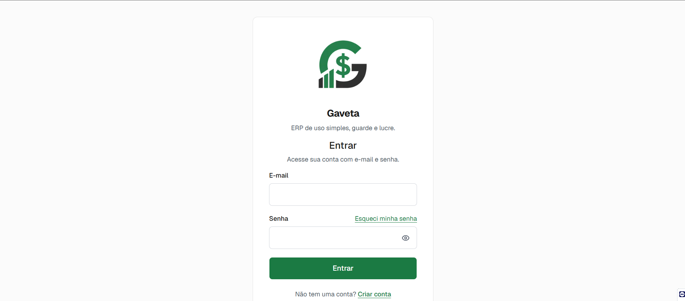

<div align="center">


**ERP web leve, acessível e seguro para o pequeno comércio.**
Cadastro de produtos, frente de caixa e demonstrativos de faturamento — pensado para quem tem pouca intimidade com tecnologia.

[](https://gaveta-erp.vercel.app)
[](https://nextjs.org/)
[](https://react.dev/)
[](https://www.typescriptlang.org/)
[](https://supabase.com/)
[](https://securityheaders.com/)
[](LICENSE)

</div>

---

<div align="center">
  

  <br/><em>Fluxo de venda (acelerado)</em> · ▶ <a href="assets/demo/Demonstrativo%20Gaveta%20Completo.mp4">ver demonstração completa (60s)</a>
</div>

## Sobre o projeto

O **Gaveta** é um ERP web multiusuário construído como peça de portfólio com padrões de mercado. Cada usuário cadastra seus produtos, registra vendas numa **frente de caixa** rápida e acompanha o faturamento por painéis. O público inicial são **pessoas idosas e lojistas com pouca familiaridade com tecnologia** — por isso a interface prioriza **clareza, botões grandes, alto contraste e poucos passos**.

Dois pilares guiaram todo o desenvolvimento: **simplicidade de uso** e **segurança dos dados** (tratada como requisito de primeira classe, não como um "extra no final"). O sistema está **em produção**, com custo de infraestrutura de **R$ 0** (todos os serviços em plano gratuito).

## Funcionalidades

- **Frente de caixa** rápida: busca por nome com autocompletar, item avulso por digitação, **leitura de código de barras por scanner USB e pela câmera** (no celular), **desconto** no total e cálculo automático.
- **Formas de pagamento** com **taxas por método** (dinheiro, Pix, débito, crédito à vista, crédito parcelado, vale) e **parcelamento**; registro transacional que **baixa o estoque** automaticamente.
- **Comprovante de venda** (não fiscal): impressão em **bobina 80/58 mm e A4** com pré-visualização, cabeçalho com nome/logo e rodapé personalizáveis; **compartilhamento por texto** (WhatsApp, e-mail).
- **Estorno de venda que devolve o estoque** e **histórico imutável de movimentação de estoque** (venda, estorno, reposição, ajuste).
- **Fechamento de caixa**: abertura com troco, **sangria/suprimento** e conferência (esperado × contado).
- **Financeiro** em três abas: **Vendas**, **Despesas** (por categoria) e **Resumo** (receita bruta, taxas, receita líquida, despesas, **resultado** e **projeção do mês**), com filtros por período e forma de pagamento.
- **Dashboards**: inicial (indicadores), estoque (filtros dinâmicos) e financeiro.
- **Produtos**: CRUD com código de barras opcional (1:N) e opção de **controlar estoque ou não** (ex.: marmitas).
- **Preferências**: tema claro/escuro, **identidade da loja** (nome + logo com upload e recorte), taxas por método e opções de impressão.
- **PWA instalável** (tela cheia no celular), **acessibilidade** (AA), **multiusuário com isolamento total via RLS** e **LGPD** (aceite no cadastro + exclusão de conta/dados).

## Telas

| Frente de caixa | Financeiro | Painel inicial |
| :-------------: | :--------: | :------------: |
|  |  |  |
| **Produtos** | **Estoque** | **Login** |
|  |  |  |

## Stack

| Camada | Tecnologia | Por quê |
| --- | --- | --- |
| Front-end | **Next.js 16** (App Router) + **React 19** + **TypeScript 5** | Padrão de mercado, renderização no servidor, ótimo para portfólio |
| Estilo / UI | **Tailwind CSS v4** + **shadcn/ui** (Base UI) | Componentes acessíveis, design responsivo rápido |
| Back-end / DB | **Supabase (PostgreSQL)** | Banco relacional gerenciado, ideal para vendas e relatórios |
| Autenticação | **Supabase Auth** (`@supabase/ssr`) | Login robusto com recuperação de senha |
| Isolamento de dados | **PostgreSQL Row Level Security** | Isolamento por usuário no nível do banco (defense-in-depth) |
| Rate limiting | **Upstash Redis** (`@upstash/ratelimit`) | Anti força-bruta por IP e por ação |
| Validação | **Zod** | Validação no servidor, não só no cliente |
| Feedback / UX | **Sonner** (toasts) | Microinterações acessíveis |
| Hospedagem | **Vercel** (portável para Cloudflare Pages) | Deploy automático via GitHub |
| Testes | **Vitest** + **Playwright** | Unidade/integração, RLS e ponta a ponta |

## Segurança

> A tese deste projeto: **"feito com IA" não é sinônimo de inseguro.** A IA acelerou a implementação, mas o **modelo de ameaças**, a exigência de **defesa em camadas** e a **verificação de cada controle** partiram do desenvolvedor. Documentação completa e evidências em **[`docs/05-SEGURANCA-HARDENING.md`](docs/05-SEGURANCA-HARDENING.md)**.

**Camadas implementadas**

- **Autorização no banco (RLS):** Row Level Security ativo em **todas** as tabelas, com políticas por operação restritas a `auth.uid() = user_id`. Mesmo que a aplicação falhasse, o banco não entrega dados de um usuário a outro.
- **Sessão à prova de token forjado:** `supabase.auth.getUser()` no servidor (revalida o token) — **nunca** `getSession()`.
- **Validação no servidor:** schemas **Zod** aplicados nas Server Actions antes de qualquer operação; o cliente é conveniência, não fronteira de confiança.
- **Senha alinhada ao NIST SP 800-63B:** comprimento + blocklist de senhas previsíveis + proibição de conter nome/e-mail, priorizando usabilidade (público idoso) com dica acessível.
- **Gestão de segredos:** `service_role` exclusiva de servidor (sem `NEXT_PUBLIC_`), nunca commitada; **chave rotacionada** como higiene preventiva.
- **Rate limiting** (Upstash Redis) por IP e por ação em login, cadastro, recuperação e redefinição.
- **CSRF:** Server Actions rejeitam requisições cross-origin (`Origin` × `Host`).
- **CSP estrita com nonce + `strict-dynamic`** (sem `unsafe-inline` em scripts), `frame-ancestors 'none'`, **HSTS**, `nosniff` e demais cabeçalhos — nota **A** no securityheaders.com.

**Como foi verificado (evidências)**

- **16 testes automatizados de acesso cruzado de RLS** provam, para cada tabela e para o storage, que um usuário não lê/edita/apaga/forja dados de outro.
- **Rate limiting testado ponta a ponta** contra o Preview (12 logins → bloqueio a partir do 9º), com confirmação da chave gravada no Redis.
- **CSRF** validado com `Origin` forjado (ação não executa); **cabeçalhos/CSP** inspecionados nas respostas HTTP.
- **Backup do banco automático e criptografado** + `/security-review` sem achados de alta confiança.

## Acessibilidade

Contraste **AA**, fontes grandes, alvos de toque **≥ 44px**, rótulos `aria`, foco visível, respeito a `prefers-reduced-motion` e textos em linguagem simples. Diretrizes em [`docs/02-DESIGN-SYSTEM-IDOSOS.md`](docs/02-DESIGN-SYSTEM-IDOSOS.md).

## Como rodar localmente

```bash
# 1. Instalar dependências
npm install

# 2. Configurar variáveis (copie e preencha com suas chaves do Supabase)
cp .env.example .env.local

# 3. Rodar em desenvolvimento
npm run dev
```

Scripts úteis: `npm run lint`, `npm run test` (Vitest), `npm run test:rls` (RLS), `npm run test:e2e` (Playwright), `npm run build`.

## Documentação

Todo o planejamento e as decisões estão em [`/docs`](./docs):

- [Visão geral](docs/00-VISAO-GERAL.md) · [Roadmap por fases](docs/01-ROADMAP-FASES.md) · [Design system para idosos](docs/02-DESIGN-SYSTEM-IDOSOS.md)
- [Segurança e modelo de dados](docs/03-SEGURANCA-E-DADOS.md) · [Política de privacidade (LGPD)](docs/04-POLITICA-PRIVACIDADE.md)
- [**Segurança & hardening** — controles, evidências e verificação](docs/05-SEGURANCA-HARDENING.md) · [Qualidade (testes/Lighthouse)](docs/06-QUALIDADE-FASE8.md) · [Mobile: PWA/TWA](docs/07-MOBILE-PWA-TWA.md)

## Estado do projeto

Em produção em **[gaveta-erp.vercel.app](https://gaveta-erp.vercel.app)**, com deploy automático a cada push na `main`. Fases 1–8 e melhorias A–H concluídas (segurança, qualidade, comprovante, financeiro, fechamento de caixa, PWA). Publicação na Play Store (TWA) e emissão fiscal (NFC-e) estão documentadas como evoluções futuras.

## Licença

MIT © Adriano Cardoso
